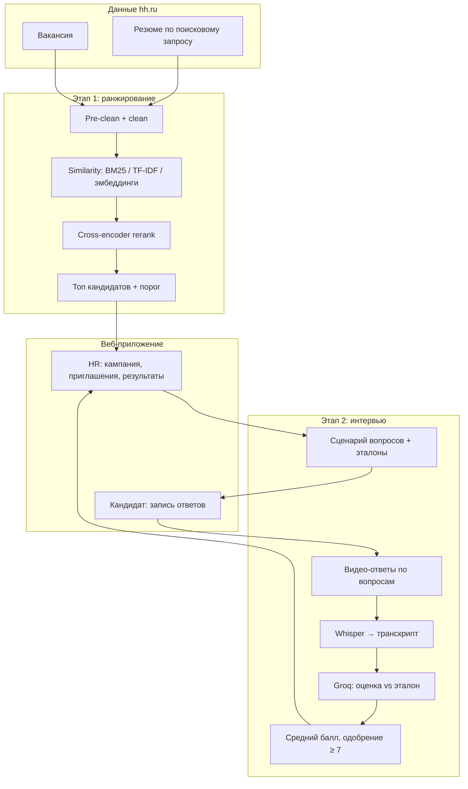

# Система автоматического скрининга кандидатов — общее описание

Документ для **введения и обзорной главы** диссертации. Детали этапов — в отдельных файлах.

| Этап | Документ |
|------|----------|
| **1. Ранжирование резюме ↔ вакансия** | [DISSERTATION_RANKING.md](DISSERTATION_RANKING.md) |
| **2. Видео-интервью и оценка ответов** | [DISSERTATION_INTERVIEW.md](DISSERTATION_INTERVIEW.md) |
| Запуск веб-интерфейса | [WEB_APP.md](WEB_APP.md) |

---

## 1. Тема и цель работы

**Тема:** применение нейросетевых моделей для создания системы автоматического скрининга кандидатов.

**Цель:** многоэтапный отбор кандидатов на вакансию: сначала по **соответствию резюме**, затем по **качеству ответов на структурированном видео-интервью**.

В репозитории реализованы **два этапа** и **веб-приложение**, объединяющее их в один сценарий для HR и кандидата.

---

## 2. Архитектура системы



---

## 3. Этап 1 — кратко (ранжирование)

**Задача:** Learning-to-Rank — для вакансии ранжировать резюме из корпуса и отобрать релевантных.

**Ключевые шаги:**

1. Подготовка текстов (classical для лексики, transformer для нейросетей).
2. Жёсткий фильтр по стажу (0,8× минимум вакансии).
3. Similarity + признак `experience_match` → `final_score` → нормализация.
4. Динамический порог (90-й перцентиль) и top-10.
5. Опционально cross-encoder для уточнения порядка.

**Результат для HR:** упорядоченный список кандидатов с баллами (в веб — топ-5).

→ Подробно: [DISSERTATION_RANKING.md](DISSERTATION_RANKING.md)

---

## 4. Этап 2 — кратко (интервью)

**Задача:** оценить **содержание** устных ответов кандидата на фиксированные вопросы (не анализ эмоций по видео).

**Ключевые шаги:**

1. HR задаёт сценарий (вопрос + эталонный ответ на каждый пункт).
2. Кандидат в браузере: **один вопрос → одна запись → загрузка видео**.
3. Сервер: видео → аудио → Whisper → текст.
4. Groq (LLM) сравнивает ответ с эталоном и вакансией → балл 0–10 по вопросу.
5. Средний балл по всем вопросам; **одобрен**, если среднее **≥ 7**.

**Результат для HR:** таблица оценок и решение «одобрен / не одобрен».

→ Подробно: [DISSERTATION_INTERVIEW.md](DISSERTATION_INTERVIEW.md) (глава).  
→ Технически пошагово: [INTERVIEW_DETAILED.md](INTERVIEW_DETAILED.md) (запись, API, ffmpeg, Whisper, Groq, файлы, БД).

---

## 5. Веб-приложение (сквозной сценарий)

Связывает оба этапа в один UX:

| Роль | Действия |
|------|----------|
| **HR** | Ссылка на вакансию hh + поисковая строка резюме → ранжирование → топ → приглашения (email) → загрузка JSON с вопросами → просмотр результатов интервью |
| **Кандидат** | Вход по приглашению → пошаговое видео-интервью |

Стек: **Vue 3** (фронт), **FastAPI** (API, БД), **Python** (ранжирование, ASR, Groq) — см. [WEB_APP.md](WEB_APP.md).

---

## 6. Данные и воспроизводимость

| Область | Путь |
|--------|------|
| Сырые / подготовленные данные | `data/raw/`, `data/prepared/` |
| Результаты ранжирования | `data/results/pipeline_*`, отчёты `RANKING_COMPARISON_*` |
| Интервью | `data/interviews/` |
| Конфигурация пайплайна | `config/pipeline_config.py`, `config/interview_config.py` |

Сбор с hh.ru: `main.py`, `vacancies.py`, токен в `data/token.json` — см. [first_step/FACT_DATA_DOWNLOAD.md](first_step/FACT_DATA_DOWNLOAD.md).

---

## 7. Технологии (сводка)

| Компонент | Технологии |
|-----------|------------|
| Этап 1, лексика | BM25, TF-IDF, pymorphy3 |
| Этап 1, семантика | E5, MiniLM, ruSBERT, MPNet (sentence-transformers) |
| Rerank | Cross-encoder (DiTy/russian и др.) |
| Этап 2, ASR | OpenAI Whisper, ffmpeg |
| Этап 2, оценка | Groq API (Llama 3.3), langchain-groq |
| Веб | Vue 3, FastAPI, SQLite |

---

## 8. Что писать во введении / обзорной главе

1. Проблема автоматизации скрининга и место LTR + интервью.  
2. Источник данных (hh.ru).  
3. **Два реализованных этапа** и их связь (схема выше).  
4. Роль веб-интерфейса как оболочки.  
5. Отсылки к главам: глава про ранжирование → `DISSERTATION_RANKING.md`; глава про интервью → `DISSERTATION_INTERVIEW.md`.  
6. Ограничения: оценка интервью по транскрипту; зависимость от API hh и Groq.

---

## 9. Структура документации проекта

```
docs/
  README.md                      ← оглавление
  DISSERTATION_SYSTEM_OVERVIEW.md ← этот файл (общая картина)
  DISSERTATION_RANKING.md        ← глава: ранжирование
  DISSERTATION_INTERVIEW.md      ← глава: интервью
  first_step/                    ← детали данных и факты этапа 1
  WEB_APP.md, PIPELINE_*.md      ← запуск
```
