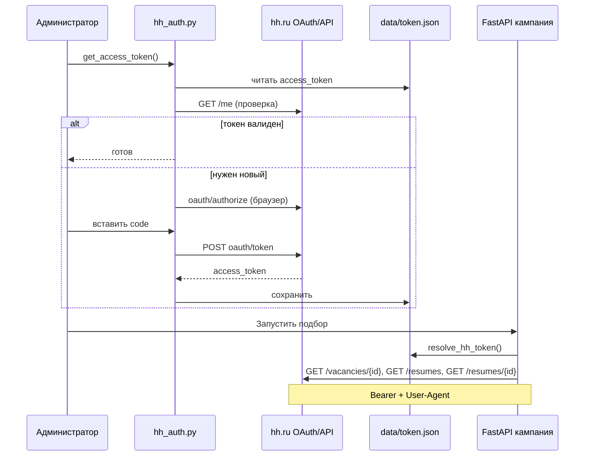

# Авторизация и доступ к API HeadHunter (hh.ru)

Документ описывает, как в проекте настраивается и используется доступ к API hh.ru для загрузки вакансий и резюме на этапе **Resume–Vacancy Matching**.

Это **отдельная** авторизация от входа HR в веб-приложение: HR логинится в системе по email/паролю из БД, а доступ к hh.ru — через OAuth-токен работодателя, который хранится в `data/token.json`.

---

## Назначение

HeadHunter разделяет публичные и работодательские методы API. В официальном API путь **`/vacancies`** (множественное число); отдельного `/vacancy` нет.

| Операция | Эндпоинт | Токен |
|----------|----------|-------|
| **Поиск вакансий** (только CLI) | `GET https://api.hh.ru/vacancies?text=...` | желателен |
| **Одна вакансия по ID** | `GET https://api.hh.ru/vacancies/{id}` | иногда нужен (403) |
| **Поиск резюме** | `GET https://api.hh.ru/resumes?text=...` | **обязателен** |
| **Полное резюме** | `GET https://api.hh.ru/resumes/{id}` | **обязателен** |
| **Проверка токена** | `GET https://api.hh.ru/me` | **обязателен** |

Без валидного `access_token` система **не может** искать и скачивать резюме. Вакансию по прямой ссылке HR часто удаётся загрузить без токена; **поиск** вакансий по тексту в веб-приложении **не используется** — HR указывает URL конкретной вакансии.

Подробная таблица всех эндпоинтов и query-параметров — в разделе [«Эндпоинты API и query-параметры»](#эндпоинты-api-и-query-параметры).

---

## Предварительная настройка

### OAuth-приложение на dev.hh.ru

В `.env` задаются учётные данные приложения:

```env
CLIENT_ID=...
CLIENT_SECRET=...
HH_CONTACT_EMAIL=your@email.com   # или WEB_HR_EMAIL
HH_APP_NAME=AIResumeScreening/1.0   # опционально
```

- `CLIENT_ID`, `CLIENT_SECRET` — читает `services/api/hh_auth.py`.
- Без них интерактивное получение токена невозможно.

### User-Agent (обязателен для всех запросов)

По правилам hh.ru каждый запрос к API должен содержать `User-Agent` с контактным email.

Формирование — `services/api/hh_http.py`:

```
User-Agent: AIResumeScreening/1.0 (your@email.com)
```

При ошибке `bad_user_agent` проверьте `HH_CONTACT_EMAIL` или `WEB_HR_EMAIL` в `.env`.

---

## Получение access_token (OAuth 2.0, Authorization Code)

Реализация: `services/api/hh_auth.py`, функция `get_access_token()`.

Процесс **интерактивный**, выполняется **один раз в терминале** (не из веб-UI).

### 1. Проверка сохранённого токена

1. Читается `data/token.json` (`config/paths.py` → `TOKEN_FILE`).
2. Если есть `access_token`, вызывается `check_token_valid()`:
   - `GET https://api.hh.ru/me`
   - заголовки: `User-Agent` + `Authorization: Bearer {token}`
3. Ответ **200** → токен действующий, OAuth не запускается.

### 2. Запрос authorization code

Если токена нет или он невалиден:

1. Открывается URL:
   ```
   https://hh.ru/oauth/authorize?response_type=code&client_id={CLIENT_ID}
   ```
2. Пользователь входит в **аккаунт работодателя** на hh.ru и подтверждает доступ приложению.
3. После редиректа в URL появляется параметр `code` — его **вручную** вставляют в терминал.

### 3. Обмен code на access_token

```
POST https://hh.ru/oauth/token
Content-Type: application/x-www-form-urlencoded

grant_type=authorization_code
code={code}
client_id={CLIENT_ID}
client_secret={CLIENT_SECRET}
```

В ответе — JSON с полем `access_token`.

### 4. Сохранение

В `data/token.json` записывается:

```json
{
  "access_token": "..."
}
```

**Refresh token в проекте не сохраняется.** После истечения срока — повторный запуск команды ниже.

### Команда получения / обновления токена

```bash
python -c "from services.api.hh_auth import get_access_token; get_access_token()"
```

---

## Эндпоинты API и query-параметры

Ниже — **все** HTTP-вызовы к hh.ru, которые есть в репозитории, с параметрами из кода. Базовый хост API: `https://api.hh.ru`.

Общие **заголовки** для API (кроме OAuth token exchange):

| Заголовок | Значение | Обязателен |
|-----------|----------|------------|
| `User-Agent` | `AIResumeScreening/1.0 (email@...)` — `services/api/hh_http.py` | **да** |
| `Authorization` | `Bearer {access_token}` | зависит от метода |

---

### OAuth (не api.hh.ru)

#### `GET https://hh.ru/oauth/authorize`

Используется при получении токена (`services/api/hh_auth.py`).

| Query-параметр | Значение в проекте | Описание |
|----------------|-------------------|----------|
| `response_type` | `code` | Authorization Code flow |
| `client_id` | из `.env` `CLIENT_ID` | ID приложения dev.hh.ru |

Пример:

```
https://hh.ru/oauth/authorize?response_type=code&client_id=XXXXXXXX
```

В проекте **не** передаются: `redirect_uri`, `state`, `scope` (используются настройки приложения по умолчанию на стороне hh).

#### `POST https://hh.ru/oauth/token`

Тело запроса (`application/x-www-form-urlencoded`):

| Параметр | Значение |
|----------|----------|
| `grant_type` | `authorization_code` |
| `code` | код из URL после авторизации (ввод в терминал) |
| `client_id` | `CLIENT_ID` |
| `client_secret` | `CLIENT_SECRET` |

Ответ (используется поле): `access_token`.

---

### `GET /me` — проверка токена

| | |
|--|--|
| **URL** | `https://api.hh.ru/me` |
| **Query** | нет |
| **Токен** | **обязателен** |
| **Код** | `services/api/hh_auth.py` → `check_token_valid()` |
| **Успех** | HTTP 200 → токен считается действующим |

---

### Вакансии: `GET /vacancies` и `GET /vacancies/{id}`

В API HeadHunter ресурс называется **`vacancies`**, не `vacancy`.

#### A. Поиск вакансий — `GET https://api.hh.ru/vacancies`

| | |
|--|--|
| **Где в проекте** | только CLI: `services/api/hh_fetch_vacancies.py` (скрипт сбора корпуса, **не** веб-кампания) |
| **Токен** | Bearer (в коде скрипта — да) |

| Query-параметр | Значение в проекте | Описание |
|----------------|-------------------|----------|
| `text` | строка запроса, напр. `php developer` | поисковая фраза (как на hh.ru) |
| `page` | `0`, `1`, … | номер страницы (с нуля) |
| `per_page` | `20` | размер страницы |

Цикл: до `per_query // 20` страниц (по умолчанию до **100** вакансий на query), пауза **0.5 с** между запросами.

Пример:

```
GET https://api.hh.ru/vacancies?text=php+developer&page=0&per_page=20
```

Ответ: JSON с массивом **`items`** — краткие карточки вакансий (поле `id` для полной загрузки).

Сохранение: `data/raw/vacancies/vacancies_{query}.json`.

**В веб-приложении этот эндпоинт не вызывается.** HR вставляет **прямую ссылку** на одну вакансию (`https://hh.ru/vacancy/132677143`), из неё извлекается ID.

---

#### B. Одна вакансия по ID — `GET https://api.hh.ru/vacancies/{vacancy_id}`

| | |
|--|--|
| **Path-параметр** | `vacancy_id` — числовой ID из URL |
| **Query** | **нет** (в проекте дополнительные параметры не передаются) |
| **Где в проекте** | **веб:** `web_api/services/hh_fetch.py` → `fetch_vacancy_by_id()`; **CLI:** `services/api/hh_fetch_full_vacancies.py` |

**Извлечение ID из ссылки HR** (`parse_vacancy_id`):

| Шаблон URL | Пример |
|------------|--------|
| `hh.ru/vacancy/{id}` | `https://hh.ru/vacancy/132677143` |
| `hh.ru/vacancies/{id}` | альтернативный формат |
| `vacancyId={id}` | query в старом формате |
| только цифры | `132677143` |

**Логика запроса в веб-приложении:**

1. `GET /vacancies/{id}` **без** `Authorization` (публичная вакансия).
2. Если **403** — повтор с `Bearer` токеном (своя, архивная или закрытая вакансия работодателя).
3. **404** — вакансия снята или неверный ID.
4. **200** — полный JSON вакансии (`name`, `description`, `key_skills`, …) → сохраняется в `data/raw/full/vacancies/vacancies_camp_{N}.json`.

Пример:

```
GET https://api.hh.ru/vacancies/132677143
User-Agent: AIResumeScreening/1.0 (hr@company.com)
Authorization: Bearer ...   # только при повторе после 403
```

---

### Резюме: `GET /resumes` и `GET /resumes/{id}`

#### A. Поиск резюме — `GET https://api.hh.ru/resumes`

| | |
|--|--|
| **Где в проекте** | **веб:** `web_api/services/campaign_pipeline.py` → `fetch_resume_short_list()`; **CLI:** `services/api/hh_fetch_raw.py` |
| **Токен** | **обязателен** (работодательский доступ) |

| Query-параметр | Значение в проекте | Описание |
|----------------|-------------------|----------|
| `text` | поисковая фраза HR (`search_text` кампании), напр. `Junior PHP разработчик` | строка поиска резюме на hh.ru |
| `page` | `0` … `N-1` | номер страницы |
| `per_page` | `20` | фиксировано в коде |

**Веб-кампания** (`web_api/config.py`, значения по умолчанию):

| Переменная `.env` | По умолчанию | Смысл |
|-------------------|--------------|--------|
| `CAMPAIGN_RESUME_SEARCH_PAGES` | `3` | сколько страниц обходить → до **60** кратких карточек |
| `CAMPAIGN_MAX_FULL_RESUMES` | `50` | максимум резюме для полной загрузки и ранжирования |

Пауза между страницами в вебе: **0.4 с**; в CLI (`hh_fetch_raw.py`): **0.5 с**.

Пример (первая страница подбора):

```
GET https://api.hh.ru/resumes?text=Junior+PHP+%D1%80%D0%B0%D0%B7%D1%80%D0%B0%D0%B1%D0%BE%D1%82%D1%87%D0%B8%D0%BA&page=0&per_page=20
User-Agent: AIResumeScreening/1.0 (hr@company.com)
Authorization: Bearer ...
```

Ответ: JSON с **`items`** — краткие карточки (`id`, `title`, …). Сохранение: `data/raw/part/resumes/resumes_camp_{id}.json`.

В проекте **не** передаются другие фильтры hh (area, experience, employment и т.д.) — только `text`, `page`, `per_page`.

---

#### B. Полное резюме — `GET https://api.hh.ru/resumes/{resume_id}`

| | |
|--|--|
| **Path-параметр** | `resume_id` — из поля `id` краткой карточки |
| **Query** | **нет** |
| **Токен** | **обязателен** |
| **Где** | `services/api/hh_fetch_full.py` |
| **Таймаут** | 10 с |

Пример:

```
GET https://api.hh.ru/resumes/abc123...
Authorization: Bearer ...
```

Обработка кодов: **200** — сохранить полный JSON; **404** — убрать из краткого списка; **429** — остановка (лимит API).

---

### Сводка: что использует веб-приложение vs CLI

| Эндпоинт | Query / path | Веб (кампания HR) | CLI (main.py, vacancies.py) |
|----------|--------------|-------------------|----------------------------|
| `GET /vacancies` | `text`, `page`, `per_page` | **нет** | **да** (`hh_fetch_vacancies.py`) |
| `GET /vacancies/{id}` | path: `vacancy_id` | **да** (ссылка от HR) | **да** (докачка полных) |
| `GET /resumes` | `text`, `page`, `per_page` | **да** (`search_text`) | **да** |
| `GET /resumes/{id}` | path: `resume_id` | **да** | **да** |
| `GET /me` | — | только проверка токена | проверка токена |

---

## Использование токена в веб-приложении

Веб-сервер **не** открывает браузер и **не** проходит OAuth при каждом подборе.

`web_api/services/hh_token.py` → `resolve_hh_token()`:

| Ситуация | Результат |
|----------|-----------|
| Файла `data/token.json` **нет** | `token=None`, ошибки нет → **demo-режим** |
| Файл есть, токен **пустой или невалиден** | ошибка «Переавторизуйтесь…», demo **не** включается |
| Токен **валиден** | реальный поиск и скачивание с hh.ru |

Demo-режим копирует готовый корпус резюме (`copy_demo_corpus` в `web_api/services/campaign_pipeline.py`); в UI отображается badge «учебный режим».

---

## Где токен участвует в пайплайне кампании

### Создание кампании (`POST /api/campaigns`)

1. Из URL извлекается ID вакансии — `parse_vacancy_id()` (`web_api/services/hh_fetch.py`).
2. `fetch_vacancy_by_id()`:
   - сначала `GET /vacancies/{id}` **без** токена;
   - при **403** — повтор **с** Bearer-токеном (своя/закрытая вакансия).
3. В фоне — `_run_full_campaign_job` → `ingest_from_hh()`.

### Загрузка резюме (`ingest_from_hh`)

**С валидным токеном:**

1. Краткий список: `GET https://api.hh.ru/resumes?text=...&page=...&per_page=20`
   - до `CAMPAIGN_RESUME_SEARCH_PAGES` страниц;
   - пауза 0.4 с между запросами;
   - лимит `CAMPAIGN_MAX_FULL_RESUMES`.
2. Полные резюме: `fetch_full_resumes()` → `GET https://api.hh.ru/resumes/{id}` для каждого ID.
3. Сохранение: `data/raw/part/resumes/resumes_camp_{id}.json`, `data/raw/full/resumes/resumes_camp_{id}.json`.

**Без токена (demo):** копирование из `resumes_{fallback}.json` или `resumes_full.json`.

### HTTP-заголовки

```python
# services/api/hh_http.py → hh_headers(token)
{
  "User-Agent": "AIResumeScreening/1.0 (email@...)",
  "Authorization": "Bearer {access_token}"   # если token передан
}
```

---

## Диаграмма потока



---

## Ошибки и ограничения

| Ситуация | Поведение |
|----------|-----------|
| HTTP **429** | лимит API; подбор падает, нужна пауза 10–15 мин |
| **403** на вакансию | нужен токен аккаунта-работодателя, которому принадлежит вакансия |
| **404** резюме | пропуск при полной загрузке |
| Истёкший токен | `check_token_valid` → false → переавторизация |
| Нет `CLIENT_ID` / `CLIENT_SECRET` | OAuth невозможен |

Сообщения для HR — `web_api/services/user_messages.py` (например: «Нужно обновить доступ к hh.ru…»).

---

## Ключевые файлы

| Файл | Назначение |
|------|------------|
| `services/api/hh_auth.py` | OAuth, проверка `/me`, запись `token.json` |
| `services/api/hh_http.py` | User-Agent и Bearer-заголовки |
| `web_api/services/hh_token.py` | чтение токена для веба без интерактива |
| `web_api/services/hh_fetch.py` | загрузка вакансии `GET /vacancies/{id}` |
| `web_api/services/campaign_pipeline.py` | поиск `GET /resumes`, demo |
| `services/api/hh_fetch_vacancies.py` | поиск `GET /vacancies` (CLI) |
| `services/api/hh_fetch_full_vacancies.py` | полные вакансии `GET /vacancies/{id}` (CLI) |
| `services/api/hh_fetch_raw.py` | поиск резюме (CLI) |
| `services/api/hh_fetch_full.py` | полные резюме по ID |
| `data/token.json` | хранилище `access_token` |
| `config/paths.py` | путь `TOKEN_FILE` |

---

## Для диссертации (краткие тезисы)

1. **Два уровня авторизации:** HR → JWT в веб-приложении; система → OAuth Bearer к API hh.ru.
2. **Привязка к работодателю:** поиск резюме выполняется от имени аккаунта, прошедшего OAuth на dev.hh.ru.
3. **Demo без hh.ru** — только при отсутствии `token.json`; просроченный токен не переключает на demo, а завершает подбор ошибкой.
4. **Refresh token не реализован** — при истечении `access_token` требуется ручная переавторизация командой `get_access_token()`.
5. **User-Agent с email** — обязательное требование API hh.ru для всех HTTP-запросов.

См. также: `docs/WEB_APP.md`, `docs/first_step/FACT_DATA_DOWNLOAD.md` (детали CLI-сбора).
