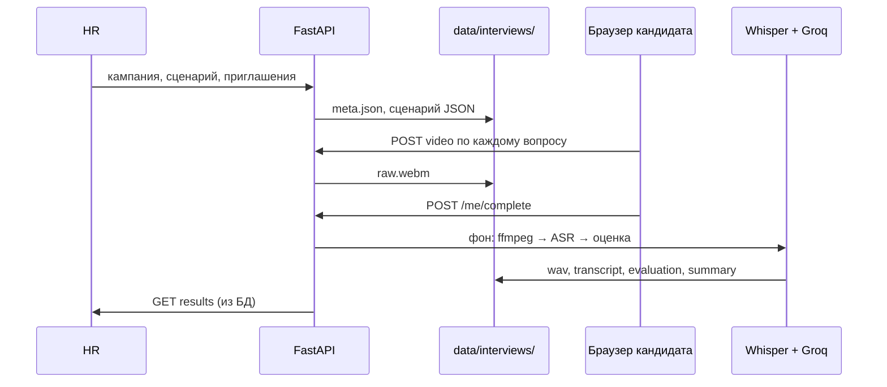

# Видео-интервью: детальное описание работы

Техническая спецификация этапа 2: от приглашения HR до `approved` в БД.  
Краткая версия для главы: [DISSERTATION_INTERVIEW.md](DISSERTATION_INTERVIEW.md).  
CLI: [INTERVIEW_PIPELINE.md](INTERVIEW_PIPELINE.md).

**Код:** `services/interview/`, `web_api/routers/interviews.py`, `web_api/services/interview_runner.py`, `frontend/src/views/CandidateInterviewView.vue`, `config/interview_config.py`.

**Сразу про файлы и пайплайн:** [§2 — где что лежит, ffmpeg, transcript.json, обработка по вопросам, пустой транскрипт, LLM](#2-файлы-артефакты-и-цепочка-обработки-явно).

---

## 1. Что делает этап и чего не делает

| Делает | Не делает |
|--------|-----------|
| Оценивает **содержание** ответа по транскрипту речи | Анализ мимики, эмоций, жестов по видео |
| Сравнивает ответ с **эталоном** и контекстом **вакансии** (LLM) | Проверка личности, антифрод по видео |
| Один **видеофайл на вопрос** | Одно длинное видео на всё интервью |
| Итог: средний балл 0–10, **одобрен** если среднее ≥ порога (7) | Ранжирование резюме (это этап 1) |

---

## 2. Файлы, артефакты и цепочка обработки (явно)

Ниже — ответы на типичные вопросы «что куда пишется» и «что за чем идёт». Остальной документ раскрывает те же шаги в контексте веба и API.

### 2.1. Где сохраняются файлы

Корень всех артефактов одного кандидата:

```text
data/interviews/{interview_uid}/
```

`interview_uid` — например `int_a1b2c3d4e5f6` (создаётся при приглашении).

| Когда | Кто создаёт | Полный путь | Содержимое |
|-------|-------------|-------------|------------|
| Приглашение HR | `init_interview` | `data/interviews/{interview_uid}/meta.json` | `query`, список `question_ids`, порог |
| Загрузка ответа кандидатом | API `POST .../video` | `data/interviews/{interview_uid}/questions/{question_id}/raw.webm` | Видео+аудио с браузера (WebM) |
| После ffmpeg | `prepare_audio` | `.../questions/{question_id}/audio_16k.wav` | Только звук, см. §2.3 |
| После Whisper | `transcribe_audio` | `.../questions/{question_id}/transcript.json` | Текст речи, см. §2.4 |
| После Groq | `evaluate_and_save` | `.../questions/{question_id}/evaluation.json` | `score`, `summary` |
| После всех вопросов | `finalize_interview` | `data/interviews/{interview_uid}/interview_summary.json` | Средний балл, `approved` |
| Копия итога | `finalize_interview` | `data/results/interviews/{interview_uid}_{query}.json` | То же, для отчётов |
| Сценарий вопросов | HR / шаблон | `data/interviews/scenarios/{query}.json` | Вопросы и эталоны (общий на кампанию) |

До нажатия «Следующий вопрос» видео **не** лежит на диске — только в памяти браузера.

### 2.2. Обработка идёт **отдельно для каждого вопроса**

После `POST /api/interviews/me/complete` сервер **не** склеивает все видео в один ролик и **не** делает один общий транскрипт.

В фоне вызывается цикл (см. `run_interview_processing`):

```text
для каждого question_id из сценария:
    process_question(interview_uid, question_id, raw.webm этого вопроса)
        → ffmpeg → Whisper → Groq
только потом один раз:
    finalize_interview(interview_uid)   # среднее по всем evaluation.json
```

У **каждого** вопроса свой каталог `questions/{question_id}/` и свой набор файлов: `raw.*` → `audio_16k.wav` → `transcript.json` → `evaluation.json`.  
Три вопроса = три полных прогона пайплайна + одна финализация.

### 2.3. Что получается после ffmpeg

**Вход:** `raw.webm` (или `raw.mp4` и т.д.) в каталоге вопроса.  
**Выход:** файл **`audio_16k.wav`** в том же каталоге.

| Параметр | Значение |
|----------|----------|
| Формат | WAV, PCM 16-bit little-endian (`pcm_s16le`) |
| Частота | 16 000 Гц |
| Каналы | 1 (моно) |
| Видеодорожка | Удалена (`-vn`) |

Видео после этого шага **больше не используется** — дальше работает только WAV. Код: `services/interview/extract_audio.py`, команда ffmpeg в §6.

### 2.4. Что сохраняет Whisper и что такое `transcript.json`

Whisper читает **`audio_16k.wav`** и записывает **`transcript.json`** в тот же каталог вопроса.

**`transcript.json`** — это не «сырой вывод модели», а **нормализованный JSON** проекта с полным текстом ответа и опциональными сегментами по времени:

```json
{
  "text": "Я проектирую REST API через ресурсы и HTTP-методы...",
  "language": "ru",
  "segments": [
    { "start": 0.0, "end": 4.2, "text": "Я проектирую REST API" },
    { "start": 4.2, "end": 9.1, "text": " через ресурсы и HTTP-методы..." }
  ],
  "model": "base",
  "source_audio": "/.../audio_16k.wav"
}
```

| Поле | Назначение |
|------|------------|
| **`text`** | **Главное:** сплошной текст всей речи кандидата по этому вопросу. **Только он** передаётся в LLM. |
| `segments` | Фрагменты с таймкодами (для отладки/анализа; в промпт не подставляются) |
| `language` | Язык, который вернул Whisper |
| `model` | Имя модели ASR (`base` по умолчанию) |
| `source_audio` | Путь к WAV, с которого делали распознавание |

Код сохранения: `services/interview/transcribe.py` → `save_json(transcript_path, payload)`.

### 2.5. Пустой транскрипт считается **ошибкой**

После Whisper в пайплайне читается `transcript.json`:

```python
candidate_answer = (transcript.get("text") or "").strip()
if not candidate_answer:
    raise ValueError("Пустой транскрипт ...")
```

Если кандидат молчал, звук не записался или ASR вернул пустую строку — **`process_question` падает**, фоновая задача переводит интервью в статус **`failed`**, Groq для этого вопроса **не вызывается**.

### 2.6. Транскрипт затем идёт в LLM (Groq)

Цепочка в коде (`services/interview/pipeline.py` → `evaluate_answer.py`):

```text
transcript.json
    → поле "text"  (= candidate_answer)
        → блок [ОТВЕТ КАНДИДАТА] в user-сообщении промпта
            → вместе с [ВАКАНСИЯ], [ВОПРОС], [ЭТАЛОННЫЙ ОТВЕТ]
                → ChatGroq (Llama 3.3 70B)
                    → evaluation.json { "score", "summary" }
```

LLM **не** получает видео и **не** получает WAV — только **текст** из `transcript["text"]`. В промпте явно указано, что текст пришёл из ASR и возможны ошибки распознавания (`prompts.py`).

### 2.7. Сводная схема на один вопрос

```text
raw.webm          (кандидат загрузил)
    ↓ ffmpeg
audio_16k.wav     (моно 16 kHz PCM)
    ↓ Whisper
transcript.json   (поле text = ответ кандидата)
    ↓ если text пустой → ОШИБКА, стоп
    ↓ Groq
evaluation.json   (score 0–10, summary)
```

После обработки **всех** вопросов: `finalize` читает все `evaluation.json` и пишет `interview_summary.json`.

---

## 3. Участники и артефакты



| Роль | Действия |
|------|----------|
| **HR** | После ранжирования: загрузить сценарий (опционально), выбрать кандидатов из топа, отправить приглашения, смотреть результаты |
| **Кандидат** | Логин → по одному вопросу: камера → запись → загрузка → завершение |
| **Сервер** | Хранит файлы, после `complete` гоняет ML-пайплайн в фоне, пишет итог в SQLite |

---

## 4. Сценарий интервью (JSON)

Файл лежит в `data/interviews/scenarios/{query}.json`, где `query` — идентификатор кампании/корпуса (например `camp_3` или `backend_developer`).

При создании кампании веб копирует шаблон `backend_developer.json`, если своего файла ещё нет (`copy_default_scenario`).

### 4.1. Поля файла

```json
{
  "pass_threshold": 7,
  "vacancy_text": "опционально: полный текст вакансии для промпта",
  "questions": [
    {
      "question_id": "q_rest_api",
      "question": "Текст на экране кандидату",
      "reference_answer": "Эталон для LLM: ключевые идеи, не обязательно дословно"
    }
  ]
}
```

| Поле | Обязательно | Назначение |
|------|-------------|------------|
| `questions[]` | да | Список вопросов в **фиксированном порядке** |
| `question_id` | да | Ключ в URL и в пути `questions/{question_id}/` |
| `question` | да | Показывается кандидату |
| `reference_answer` | да | Эталон для Groq |
| `pass_threshold` | нет | Порог одобрения (по умолчанию **7**, см. `INTERVIEW_PASS_THRESHOLD`) |
| `vacancy_text` | нет | Если пусто — подставляется текст из `data/prepared/vacancies/cleaned/transformer/vacancies_{query}.json` |

### 4.2. Загрузка HR

`POST /api/campaigns/{id}/scenario` (multipart JSON):

1. Парсится UTF-8, проверяется наличие `questions`.
2. Сохраняется в `data/interviews/scenarios/{campaign.query}.json`.
3. В БД кампании: `campaign.scenario_path` = путь к файлу.

API для кандидата и обработки читает сценарий через `scenario_for_campaign()` (сначала `scenario_path`, иначе `{query}.json`).

**Важно:** пайплайн `process_question` / `finalize` внутри `services/interview` загружает сценарий по полю `query` из `meta.json` (`load_scenario(query)` → тот же файл `{query}.json` в `scenarios/`). HR-загрузка перезаписывает этот файл — обработка и UI согласованы.

---

## 5. Жизненный цикл: от приглашения до результата

### 5.1. HR: приглашение

Условие: кампания в статусе **`ranked`** (ранжирование завершено).

`POST /api/campaigns/{campaign_id}/invitations`  
Тело: `resume_ids[]`, `emails[]` (попарно).

Для каждой пары, если приглашения ещё нет:

1. Генерируется временный пароль, создаётся `User` с ролью `candidate`.
2. `interview_uid = int_{12 hex символов}`.
3. **`init_interview(interview_uid, resume_id, campaign.query)`** — на диске:
   - `data/interviews/{interview_uid}/meta.json`:
     ```json
     {
       "interview_id": "int_...",
       "candidate_id": "resume_id",
       "query": "camp_3",
       "pass_threshold": 7,
       "question_ids": ["q1", "q2", ...]
     }
     ```
4. Запись `Invitation` + `Interview` (`status=pending`).
5. Письмо: SMTP или строка в `data/campaigns/{campaign_id}/invitation_emails.log` с URL, email, паролем.

Сценарий должен существовать до приглашений — иначе `scenario_for_campaign` упадёт с 500 при отправке.

### 5.2. Кандидат: сессия

`GET /api/interviews/me` (JWT, роль candidate).

Ответ (`InterviewSessionOut`):

- `questions[]` — все вопросы с `order` 0..N-1;
- `current_index` — сколько вопросов уже «пройдено»;
- `status` — из БД.

**Как считается `current_index`:** для каждого `question_id` в сценарии, если есть `evaluation.json` **или** любой файл `raw.*` в каталоге вопроса, вопрос считается отвеченным. Индекс = число таких вопросов (ограничено `len(questions)`).

При первом заходе, если `status == pending`, в БД ставится **`in_progress`**.

### 5.3. Кандидат: запись и загрузка (браузер)

Компонент: `CandidateInterviewView.vue`.

| Шаг UI | Технология | Что на сервере |
|--------|------------|----------------|
| **1. Включить камеру** | `navigator.mediaDevices.getUserMedia({ video: true, audio: true })` | Ничего |
| **2. Запись** | `MediaRecorder(stream, { mimeType: 'video/webm' })`, чанки в память | Ничего |
| **3. Следующий вопрос →** | `stopRecording()` → `Blob` WebM → `FormData` | `POST .../video` |

До шага 3 видео **только в RAM браузера**. Закрытие вкладки без «Следующий вопрос» = потеря записи для этого вопроса.

**Загрузка:**

```
POST /api/interviews/me/questions/{question_id}/video
Content-Type: multipart/form-data
file: {question_id}.webm
```

Сервер:

1. Проверка: интервью в `pending` или `in_progress`.
2. Временный файл → `sync_uploaded_video(interview_uid, question_id, path)`.
3. Копия в `data/interviews/{interview_uid}/questions/{question_id}/raw.webm` (суффикс из загрузки).
4. `status = in_progress`.

После успеха фронт снова вызывает `GET /me` → `current_index` увеличился → показывается следующий вопрос.

**Автозавершение:** если после загрузки `current_index >= total_questions`, фронт вызывает `POST /me/complete` без отдельной кнопки «Завершить».

### 5.4. Завершение и фоновая обработка

`POST /api/interviews/me/complete`:

1. Для **каждого** `question_id` из сценария проверяется наличие `raw.*` в `question_dir`. Иначе **400** с текстом, какого вопроса не хватает.
2. В очередь FastAPI `BackgroundTasks` ставится `_process_interview_background(interview.id)`.
3. Сразу ответ: `{ status: "processing", message: "..." }`.

Фоновая задача:

```
status → processing
для каждого question_id:
    process_question(interview_uid, qid, raw_file)
finalize_interview(interview_uid)
status → completed
score_avg, approved, summary_json → БД
completed_at = UTC now
```

При исключении: `status = failed`, `summary_json = {"error": "..."}`.

**Порядок обработки вопросов:** как в массиве `scenario["questions"]` (не параллельно — последовательный цикл в одном воркере).

---

## 6. Статусы интервью (БД)

| Статус | Когда |
|--------|--------|
| `pending` | Создано при приглашении, кандидат ещё не открывал сессию |
| `in_progress` | Открыт `/me` или загружено хотя бы одно видео |
| `processing` | Вызван `/me/complete`, идёт ffmpeg/Whisper/Groq |
| `completed` | `finalize` успешен |
| `failed` | Ошибка в фоне (нет ffmpeg, пустой транскрипт, нет GROQ_API_KEY и т.д.) |

Повторная загрузка видео при `processing` / `completed` / `failed` **запрещена** (400 «not accepting uploads»).

---

## 7. Обработка одного вопроса (`process_question`)

См. также **§2** (файлы, отдельный прогон на вопрос, транскрипт → LLM).

Вход: путь к `raw.webm` (или mp4 и др.).

Каталог: `data/interviews/{interview_uid}/questions/{question_id}/`.

### Шаг A — сохранение сырого видео

Если источник не совпадает с `raw{suffix}`, файл копируется в `raw.webm` / `raw.mp4`.

### Шаг B — аудио (`prepare_audio`)

Модуль: `services/interview/extract_audio.py`.

Для `.webm`, `.mp4`, `.mov`, … — **ffmpeg**:

```text
ffmpeg -y -i <video> -vn -acodec pcm_s16le -ar 16000 -ac 1 audio_16k.wav
```

Параметры из `interview_config.py`: **16 kHz, mono** (`AUDIO_SAMPLE_RATE`, `AUDIO_CHANNELS`).

Для чистого `.wav`/`.mp3`/… — та же конвертация в целевой WAV.

### Шаг C — ASR (`transcribe_audio`)

Модуль: `services/interview/transcribe.py`.

- Движок: **OpenAI Whisper** (`ASR_ENGINE = "whisper"`).
- Модель: **`base`** (`WHISPER_MODEL`), язык вызова: **`ru`**.
- Выход: `transcript.json`:

```json
{
  "text": "полный текст ответа",
  "language": "ru",
  "segments": [
    { "start": 0.0, "end": 2.5, "text": "фрагмент" }
  ],
  "model": "base",
  "source_audio": "путь к wav"
}
```

Пустой `text` → **ValueError** (§2.5), интервью уходит в `failed`, LLM не вызывается.

### Шаг D — оценка LLM (`evaluate_and_save`)

Модуль: `services/interview/evaluate_answer.py`. В LLM уходит **только** `transcript["text"]` как `[ОТВЕТ КАНДИДАТА]` (§2.6).

1. `vacancy_text = resolve_vacancy_text(scenario)` (см. §4.1).
2. Промпт: system `EVALUATION_SYSTEM_PROMPT` + human-блок из `build_evaluation_user_message` (`prompts.py`).
3. **ChatGroq**: модель `llama-3.3-70b-versatile`, `temperature=0.1`.
4. Ответ парсится как JSON (допускается обёртка ` ```json `); `score` clamp в **[0, 10]**.
5. `evaluation.json`:

```json
{
  "question_id": "q_rest_api",
  "question": "…",
  "score": 8,
  "summary": "Краткое объяснение на русском",
  "model": "llama-3.3-70b-versatile"
}
```

Требуется **`GROQ_API_KEY`** в окружении или `.env`.

Флаги CLI (не веб): `--skip-extract`, `--skip-transcribe`, `--skip-evaluate` для повторного прогона шагов.

---

## 8. Финализация (`finalize_interview`)

1. Для каждого вопроса **из сценария** (не только из meta) ищется `evaluation.json`.
2. Отсутствующие оценки **пропускаются** с предупреждением в лог; если не осталось ни одного score — **ValueError**.
3. Среднее: `sum(scores) / len(scores)`, округление **`INTERVIEW_AVG_DECIMALS` (2)**.
4. `approved = (avg >= pass_threshold)` — порог из `meta.json` или сценария.
5. Запись **`interview_summary.json`** в каталог интервью и копия в `data/results/interviews/{interview_uid}_{query}.json`.

Пример `interview_summary.json`:

```json
{
  "interview_id": "int_a1b2c3d4e5f6",
  "candidate_id": "resume_123",
  "query": "camp_3",
  "pass_threshold": 7.0,
  "questions": [
    {
      "question_id": "q_rest_api",
      "question": "Как вы проектируете REST API?",
      "score": 8,
      "summary": "…"
    }
  ],
  "questions_evaluated": 3,
  "questions_total": 3,
  "interview_score_avg": 7.33,
  "approved": true
}
```

HR видит это через `GET /api/campaigns/{id}/results` — поля разобраны из `Interview.summary_json`.

---

## 9. Дерево файлов на диске

Таблица путей по моментам создания — в **§2.1**. Ниже — то же деревом:

```text
data/interviews/
  scenarios/
    backend_developer.json      # шаблон
    camp_3.json                 # сценарий кампании (после HR upload / copy)
  int_{uid}/
    meta.json
    interview_summary.json      # после finalize
    questions/
      q_rest_api/
        raw.webm                # с браузера
        audio_16k.wav             # ffmpeg
        transcript.json           # Whisper
        evaluation.json         # Groq
data/results/interviews/
  int_{uid}_{query}.json        # дубликат summary для отчётов
data/campaigns/{campaign_id}/
  invitation_emails.log         # если SMTP не настроен
data/app.db                     # interviews, invitations, users
```

Пути в коде: `INTERVIEWS_DIR` / `UPLOAD_DIR` — оба `data/interviews` (`config/paths.py`, `web_api/config.py`).

---

## 10. API (кандидат)

| Метод | Путь | Назначение |
|-------|------|------------|
| GET | `/api/interviews/me` | Сессия, вопросы, прогресс |
| POST | `/api/interviews/me/questions/{question_id}/video` | Загрузка ответа |
| POST | `/api/interviews/me/complete` | Старт фоновой обработки |

Авторизация: `require_candidate` — JWT пользователя с ролью candidate, привязанного к `Invitation`.

---

## 11. API (HR)

| Метод | Путь | Назначение |
|-------|------|------------|
| POST | `/api/campaigns/{id}/scenario` | Загрузить JSON вопросов |
| POST | `/api/campaigns/{id}/invitations` | Пригласить из топа ранжирования |
| GET | `/api/campaigns/{id}/results` | Статусы интервью, баллы, summaries |

---

## 12. CLI (без веба)

Тот же `services/interview/pipeline.py`:

```bash
python run.py interview init --interview-id int_001 --candidate-id cand_42 --query backend_developer
python run.py interview process --interview-id int_001 --question-id q_rest_api --video path/to/answer.mp4
python run.py interview finalize --interview-id int_001
```

Отличия от веба:

- Видео кладёте вручную или через `process` (копия в `raw.*`).
- Нет БД и MediaRecorder — только файловая система и консольный лог.

---

## 13. Конфигурация и зависимости

| Переменная / константа | Значение по умолчанию | Где |
|------------------------|----------------------|-----|
| `INTERVIEW_PASS_THRESHOLD` | 7.0 | `config/interview_config.py` |
| `LLM_MODEL_NAME` | llama-3.3-70b-versatile | там же |
| `WHISPER_MODEL` | base | там же |
| `GROQ_API_KEY` | — | `.env` / окружение |
| `ffmpeg` | в PATH | система |
| `APP_PUBLIC_URL` | http://localhost:5173 | ссылка в письме |

Python: `openai-whisper`, `langchain-groq`, `python-dotenv` — см. `requirements.txt`.

---

## 14. Типичные сбои

| Симптом | Причина |
|---------|---------|
| 400 при `complete` | Не загружено видео для одного из `question_id` |
| `failed`, error в summary | Нет ffmpeg, Whisper, GROQ_API_KEY, пустой звук |
| Пустой транскрипт | Тишина, слишком тихо, битый WebM |
| Завышенный/заниженный балл | Ошибки ASR; LLM интерпретирует с оговоркой в промпте |
| Нельзя перезалить видео | Статус уже `processing`/`completed` |

---

## 15. Связь с этапом 1

- Приглашают только `resume_id` из **`RankingResult`** кампании.
- `query` кампании задаёт и папки `data/campaigns/...` для clean/rank, и имя сценария `{query}.json`.
- Текст вакансии для Groq — из того же transformer-clean корпуса, что и на ранжировании (если не переопределён `vacancy_text` в сценарии).

---

## 16. Схема одного вопроса (итог)

Дублирует **§2.7** с учётом браузера:

```text
[Браузер]
  getUserMedia → MediaRecorder → Blob(webm)
       ↓ POST /video
data/interviews/{uid}/questions/{qid}/raw.webm
       ↓ ffmpeg  →  audio_16k.wav (моно 16 kHz, без видео)
       ↓ Whisper  →  transcript.json (в LLM идёт только поле "text")
       ↓ если text пустой  →  ОШИБКА
       ↓ Groq  →  evaluation.json
       ↓ (для каждого вопроса отдельно; затем один finalize)
interview_summary.json + БД: score_avg, approved
```
